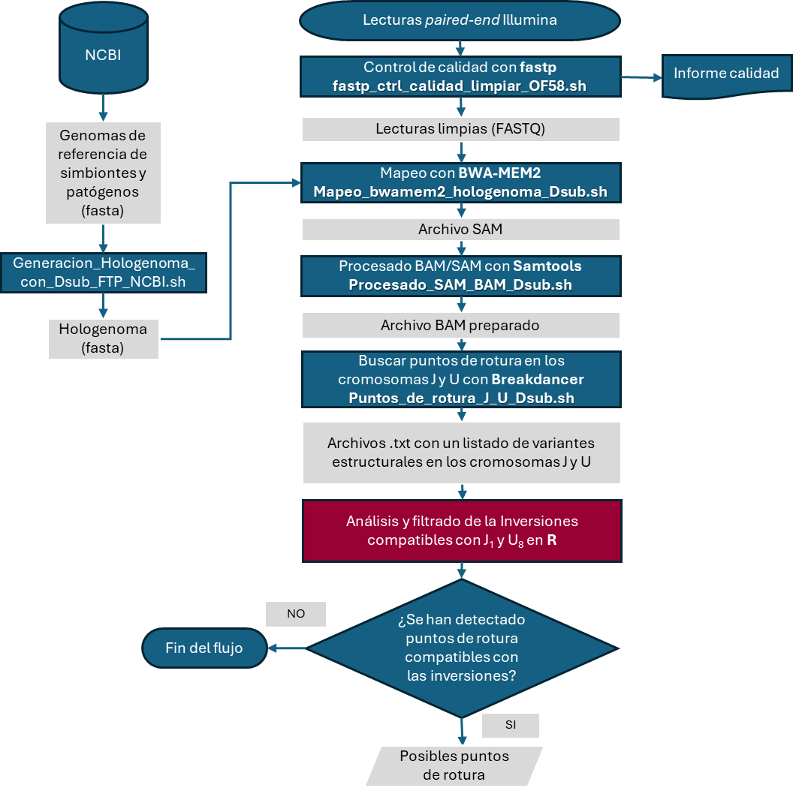

# TFM
## Proceso bioinformático automatizado para la detección de inversiones cromosómicas en *Drosophila subobscura*: estudio de las inversiones  $J_{1}$ y $U_{8}$ de la cepa OF58.

### *Scripts bash*
En los siguientes diagramas se muestra la relación y funcionalidad general de todos los *scripts bash* que contiene este repositorio relacionado con el TFM.

