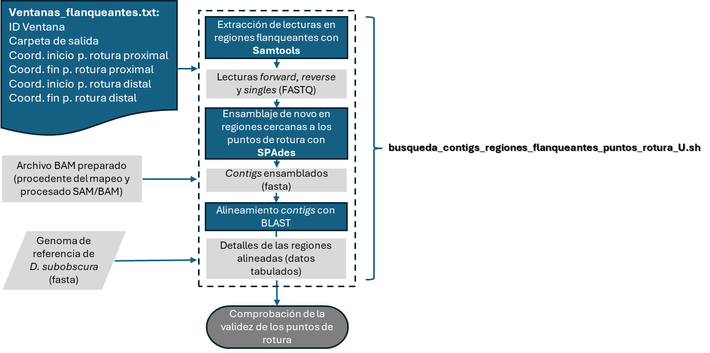
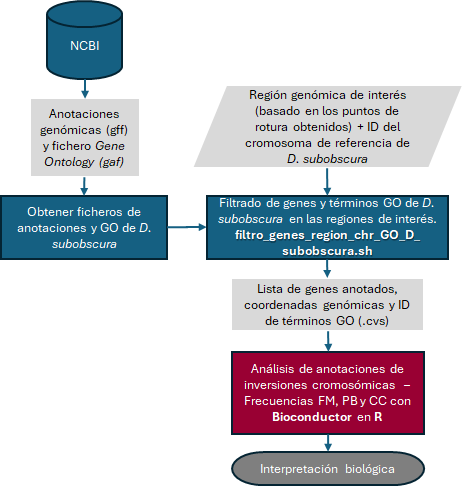

# TFM
## Proceso bioinformático automatizado para la detección de inversiones cromosómicas en *Drosophila subobscura*: estudio de las inversiones  $J_{1}$ y $U_{8}$ de la cepa OF58.

### *Scripts bash*
En los siguientes diagramas se muestra la relación y funcionalidad general de todos los *scripts bash* que contiene este repositorio relacionado con el TFM.

#### Flujo de trabajo principal
Para ejecutar el flujo de trabajo principal se deben utilizar los comandos siguiendo la siguiente secuencia:
```bash
./Generacion_Hologenoma_con_Dsub_FTP_NCBI.sh
```
```bash
./fastp_ctrl_calidad_limpiar_OF58.sh
```
```bash
./Mapeo_bwamem2_hologenoma_Dsub.sh
```
```bash
./Procesado_SAM_BAM_Dsub.sh
```
```bash
./Puntos_de_rotura_J_U_Dsub.sh
```


#### Flujo de trabajo para localizar y validar los puntos de rotura para la inversión $U_8$ 
El uso del _script_ `busqueda_contigs_regiones_flanqueantes_puntos_rotura_U.sh` se detalla en öa guía localizada en https://github.com/mercemerayo/TFM/tree/main/Contigs_U8_alineados_BLAST



#### Flujo de trabajo para filtrar genes y terminos GO en cualquier región de cualquier cromosoma de *Drosophila subobscura* 

